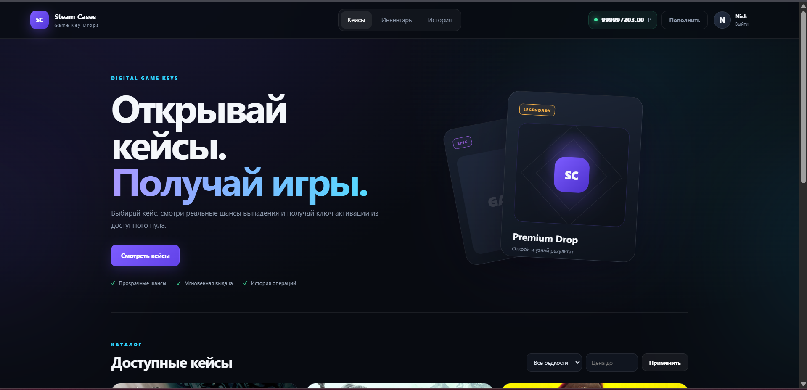
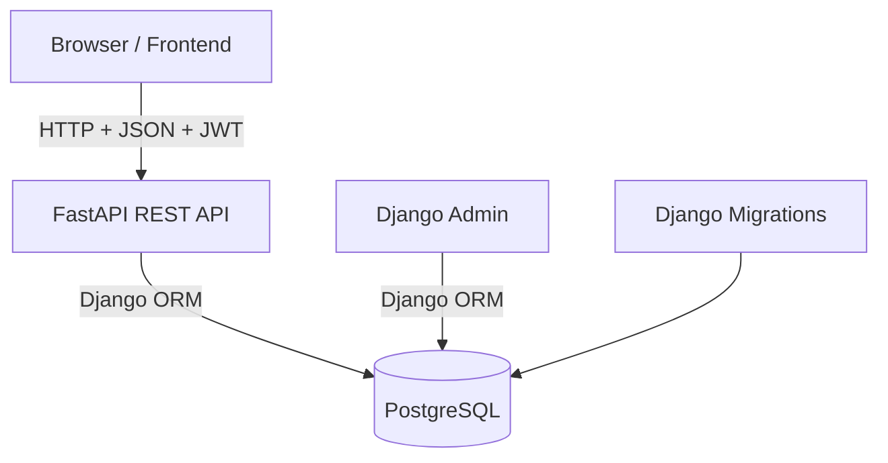

# Steam Key Store

<p align="center">
  <strong>Full-stack platform for opening game-key cases with weighted drops, JWT authentication, user inventory and admin management.</strong>
</p>

<p align="center">
  
  
  
  
  
  
</p>

> [!IMPORTANT]
> This is an **educational / portfolio project**. Balance top-ups are simulated, seeded activation keys are fake `DEMO-*` keys, and no real payment provider or Steam activation API is connected.

---

## Preview

Add screenshots to `docs/screenshots/` and uncomment the blocks below.

<!--
<p align="center">
  
</p>

<p align="center">
  
  
</p>
-->

---

## About the project

**Steam Key Store** is a client-server application that simulates a game-key case-opening platform.

The project combines:

- **Django** for ORM, migrations, authentication primitives and the admin panel;
- **FastAPI** for the client REST API;
- **PostgreSQL** as a shared relational database;
- **JWT** for user authentication;
- **HTML / CSS / JavaScript** for the current frontend;
- **Docker Compose** for local infrastructure;
- **pytest** for automated API tests.

The main engineering goal of the project is to demonstrate how Django ORM and FastAPI can work together against the same database while keeping the public API separate from Django Admin.

---

## Features

### User side

- Registration and login
- JWT Bearer authentication
- Persistent client session
- User balance
- Demo balance top-up
- Case catalog
- Price and rarity filters
- Case details with drop probabilities
- Weighted random item selection
- Case opening
- Activation-key assignment
- Personal inventory
- Copy activation key
- Mark key as used
- Opening history

### Administration

- Django Admin
- User management
- Case management
- Item management
- Drop-weight management
- Activation-key pool
- Opening history
- Transaction history
- Demo catalog generator

### Backend

- REST API with OpenAPI / Swagger
- Django ORM shared between Django and FastAPI
- PostgreSQL transactions
- Row locking during case opening
- Relational constraints and indexes
- CORS configuration
- Environment-based configuration
- Request logging
- API error handling
- Automated tests

---

## Tech stack

| Area | Technology |
|---|---|
| Backend API | FastAPI |
| ORM / Admin | Django |
| Database | PostgreSQL |
| Validation | Pydantic |
| Authentication | JWT / PyJWT |
| Password hashing | Django authentication system |
| Frontend | HTML, CSS, JavaScript |
| Infrastructure | Docker, Docker Compose |
| Testing | pytest, pytest-django, FastAPI TestClient |
| API documentation | OpenAPI / Swagger UI |

---

## Architecture



### Request flow

When a user opens a case:

```text
Browser
   │
   │ POST /api/v1/cases/{id}/open
   │ Authorization: Bearer <JWT>
   ▼
FastAPI
   │
   ├── validates JWT
   ├── loads the user
   └── calls the case-opening service
          │
          ▼
      Django ORM
          │
          ├── locks user / case rows
          ├── checks balance
          ├── selects an item by weight
          ├── locks an available key
          ├── deducts balance
          ├── assigns the key
          ├── creates Opening
          └── creates Transaction
          │
          ▼
      PostgreSQL
```

---

## Data model

The main relational entities are:

```text
User
 ├── balance
 ├── keys
 ├── openings
 └── transactions

Case
 └── CaseItem
      ├── Item
      └── weight

Item
 └── Key

Opening
 ├── User
 ├── Case
 ├── Item
 └── Key

Transaction
 └── User
```

### Drop probabilities

A case and an item are connected through the `CaseItem` model.

```text
CaseItem.weight
```

The final probability is calculated as:

```text
item weight / sum of all case weights
```

Example:

| Item | Weight | Chance |
|---|---:|---:|
| Common game | 60 | 60% |
| Rare game | 25 | 25% |
| Epic game | 10 | 10% |
| Legendary game | 5 | 5% |

The weights do **not** have to sum to 100.

---

## Project structure

```text
steam_case_backend/
│
├── django_project/
│   └── config/
│       ├── settings.py
│       ├── test_settings.py
│       ├── urls.py
│       ├── asgi.py
│       └── wsgi.py
│
├── fastapi_app/
│   ├── routers/
│   │   ├── auth.py
│   │   ├── balance.py
│   │   ├── cases.py
│   │   ├── inventory.py
│   │   └── openings.py
│   ├── config.py
│   ├── dependencies.py
│   ├── django_bootstrap.py
│   ├── exceptions.py
│   ├── main.py
│   ├── middleware.py
│   ├── presenters.py
│   ├── schemas.py
│   ├── security.py
│   └── services.py
│
├── frontend/
│   ├── index.html
│   ├── styles.css
│   └── app.js
│
├── shared/
│   ├── migrations/
│   ├── management/
│   │   └── commands/
│   │       └── seed_demo.py
│   ├── admin.py
│   ├── apps.py
│   └── models.py
│
├── tests/
│   ├── conftest.py
│   ├── test_auth.py
│   ├── test_cases.py
│   ├── test_inventory.py
│   └── test_frontend.py
│
├── .env.example
├── .gitignore
├── Dockerfile
├── docker-compose.yml
├── manage.py
├── pytest.ini
├── requirements.txt
└── README.md
```

---

## Quick start

### Requirements

Install:

- Git
- Docker Desktop / Docker Engine
- Docker Compose

Clone the repository:

```bash
git clone https://github.com/Nick11120432/Steam_key_store.git
cd Steam_key_store
```

Create the environment file.

### Linux / macOS

```bash
cp .env.example .env
```

### Windows PowerShell

```powershell
Copy-Item .env.example .env
```

Generate strong secrets:

```bash
python -c "import secrets; print('DJANGO_SECRET_KEY=' + secrets.token_urlsafe(64)); print('JWT_SECRET_KEY=' + secrets.token_urlsafe(64))"
```

Put the generated values into `.env`.

Then start the project:

```bash
docker compose up -d --build
```

Check containers:

```bash
docker compose ps -a
```

Expected state:

```text
db        Up (healthy)
migrate   Exited (0)
django    Up
fastapi   Up
```

---

## Create an administrator

```bash
docker compose exec django python manage.py createsuperuser
```

Django Admin:

```text
http://127.0.0.1:8000/admin/
```

---

## Generate demo content

The repository includes a Django management command that creates demo games, cases, drop weights and fake activation keys.

```bash
docker compose exec django python manage.py seed_demo
```

To increase the available demo-key pool:

```bash
docker compose exec django python manage.py seed_demo --keys-per-item 100
```

The command is safe to run repeatedly: it updates the demo catalog without intentionally duplicating the same cases and items.

> Demo keys use the `DEMO-*` format and are not valid Steam activation keys.

---

## Application URLs

| Service | URL |
|---|---|
| Website | `http://127.0.0.1:8001/` |
| Swagger UI | `http://127.0.0.1:8001/docs` |
| OpenAPI schema | `http://127.0.0.1:8001/openapi.json` |
| Health check | `http://127.0.0.1:8001/health` |
| Django Admin | `http://127.0.0.1:8000/admin/` |

---

## API overview

Base API prefix:

```text
/api/v1
```

### Authentication

```http
POST /api/v1/auth/register
POST /api/v1/auth/login
POST /api/v1/auth/token
GET  /api/v1/auth/me
```

### Cases

```http
GET  /api/v1/cases
GET  /api/v1/cases/{case_id}
POST /api/v1/cases/{case_id}/open
```

Case filters:

```text
min_price
max_price
rarity
limit
offset
```

Example:

```http
GET /api/v1/cases?min_price=100&max_price=1000&rarity=epic
```

### Inventory

```http
GET  /api/v1/inventory
POST /api/v1/inventory/{key_id}/use
```

### Opening history

```http
GET /api/v1/openings
```

### Balance

```http
POST /api/v1/balance/top-up
GET  /api/v1/balance/transactions
```

---

## Authentication

Protected endpoints expect a JWT Bearer token:

```http
Authorization: Bearer <access_token>
```

---

## Case opening consistency

Opening a case is handled inside a database transaction.

The service:

1. Locks the user row.
2. Locks the case configuration used by the opening.
3. Checks the current balance.
4. Selects the item using weighted randomness.
5. Searches for an available key.
6. Locks that key before assigning it.
7. Deducts the case price.
8. Creates the opening record.
9. Creates a debit transaction.

This reduces the risk of two concurrent requests receiving the same activation key.

---

## No-key policy

The behavior when the selected item has no available activation key is controlled through:

```env
CASE_NO_KEY_POLICY=item_only
```

Supported modes:

### `item_only`

The opening succeeds, but `key` is `null`.

### `error`

The opening is rolled back and the API returns:

```http
409 Conflict
```

For a real key-selling service, `error` or a separate guaranteed-delivery mechanism is generally safer.

---

## Testing

Run the complete test suite:

```bash
docker compose exec fastapi pytest -v
```

Run a single module:

```bash
docker compose exec fastapi pytest tests/test_cases.py -v
```

Run one test:

```bash
docker compose exec fastapi pytest tests/test_cases.py::test_list_case_details_and_open_case -v
```

Current automated coverage includes the main flows:

- registration;
- password hashing;
- login;
- JWT authentication;
- balance top-up;
- case catalog;
- case details;
- case opening;
- activation-key assignment;
- inventory;
- marking keys as used;
- frontend route availability.

---

## Environment variables

The application reads sensitive configuration from `.env`.

Example:

```env
DJANGO_SECRET_KEY=change-me
JWT_SECRET_KEY=change-me

DEBUG=1
ALLOWED_HOSTS=localhost,127.0.0.1,0.0.0.0

POSTGRES_DB=steam_cases
POSTGRES_USER=steam_cases
POSTGRES_PASSWORD=change-me
POSTGRES_HOST=localhost
POSTGRES_PORT=5432

JWT_ALGORITHM=HS256
JWT_ACCESS_TOKEN_EXPIRE_MINUTES=60

CORS_ORIGINS=http://localhost:3000,http://localhost:5173

CASE_NO_KEY_POLICY=item_only
LOG_LEVEL=INFO
```

Never commit the real `.env` file.

Only `.env.example` should be stored in Git.

---

## Useful Docker commands

Start:

```bash
docker compose up -d
```

Start and rebuild:

```bash
docker compose up -d --build --force-recreate
```

Show status:

```bash
docker compose ps -a
```

View logs:

```bash
docker compose logs django
docker compose logs fastapi
docker compose logs db
```

Stop:

```bash
docker compose down
```

Stop and delete the PostgreSQL volume:

```bash
docker compose down -v
```

> `docker compose down -v` removes database data.

---

## Roadmap

- [x] Django ORM models
- [x] Django Admin
- [x] FastAPI REST API
- [x] PostgreSQL
- [x] JWT authentication
- [x] Weighted case opening
- [x] Activation-key inventory
- [x] Opening history
- [x] Balance transactions
- [x] Docker Compose
- [x] Demo data generator
- [x] Basic web frontend
- [x] API tests
- [ ] JWT refresh tokens
- [ ] Email verification
- [ ] Password reset
- [ ] Rate limiting
- [ ] Redis caching
- [ ] Idempotency keys
- [ ] PostgreSQL concurrency integration tests
- [ ] Real payment-provider integration
- [ ] Payment webhook verification
- [ ] Audit log
- [ ] Encrypted activation-key storage
- [ ] React / Next.js frontend
- [ ] Production deployment
- [ ] Monitoring and tracing

---

## Production notes

The current repository is designed as a learning and portfolio project.

Before using similar software commercially, consider implementing:

- HTTPS and secure reverse proxy configuration;
- refresh-token rotation and revocation;
- rate limiting;
- email verification;
- password-reset flow;
- production-grade secrets management;
- encrypted activation-key storage;
- audit logging;
- real accounting / ledger logic;
- payment-provider webhook verification;
- idempotent payment and case-opening requests;
- anti-fraud mechanisms;
- PostgreSQL concurrency testing;
- monitoring, metrics and tracing;
- backups and recovery procedures;
- legal review for paid randomized case-opening mechanics in target jurisdictions.

---

## Security note

Do not commit:

```text
.env
real activation keys
database dumps with user data
JWT tokens
real passwords
production secrets
payment-provider credentials
```

If a secret has ever been published, rotate it instead of merely deleting it from the latest commit.

---

## Author

**Nick**

GitHub: [@Nick11120432](https://github.com/Nick11120432)

Repository: [Steam_key_store](https://github.com/Nick11120432/Steam_key_store)

---

<p align="center">
  Built for learning, experimentation and portfolio development.
</p>
